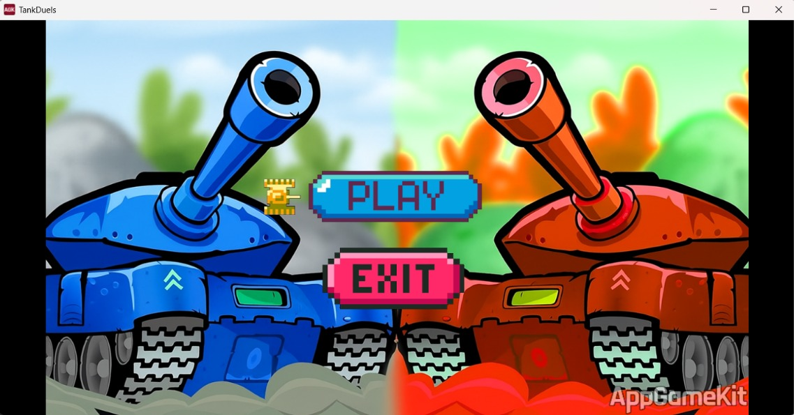
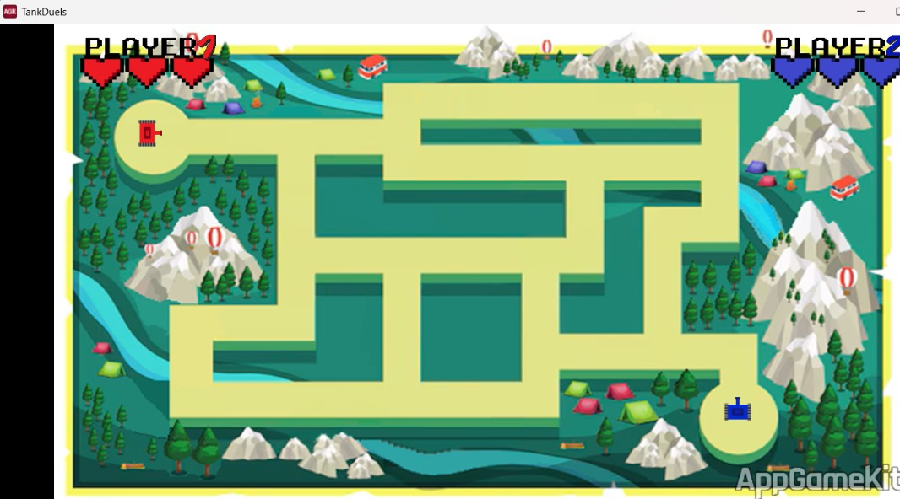
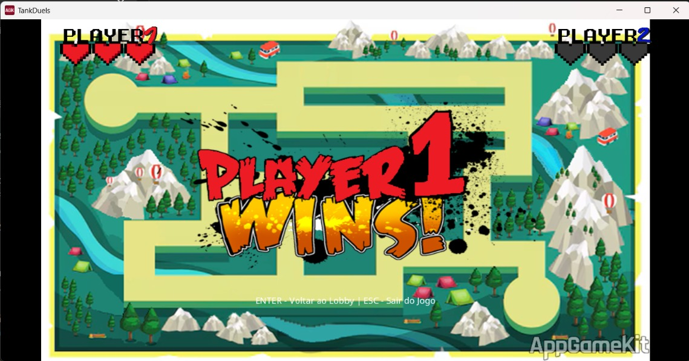
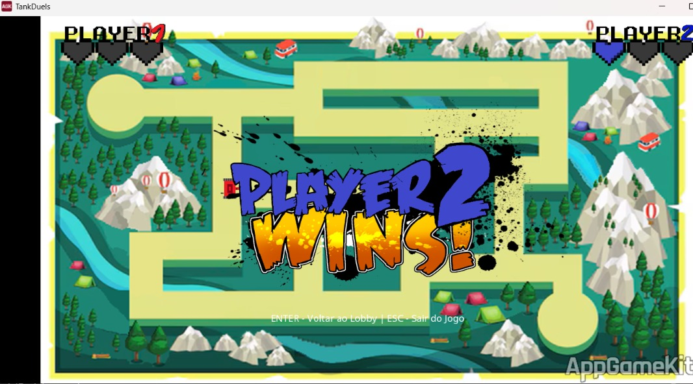

# Tank Duels

Projeto desenvolvido durante o 1º período de Ciência da Computação no Instituto Federal de Goiás (IFG).

## Sobre o projeto

Tank Duels é um jogo 2D criado em AppGameKit (AGK BASIC), desenvolvido com o objetivo de praticar lógica de programação, organização de código e manipulação de sprites.

## Funcionalidades

- Movimentação de tanques
- Sistema de combate
- Colisões entre objetos
- Menu principal
- Tela de vitória e derrota

## Tecnologias

- AppGameKit (AGK BASIC)

## Estrutura

- `main.agc` — inicialização do jogo
- `menu.agc` — menu principal
- `tank.agc` — movimentação e combate
- `background.agc` — cenário e obstáculos
- `WinLoss.agc` — telas de vitória e derrota

## Capturas de Tela

### Menu Principal

### Batalha

### Vitória do Player 1

### Vitória do Player 2

## Objetivo

Este projeto representa meu primeiro desenvolvimento completo de software e serviu como base para os estudos de lógica de programação e desenvolvimento de jogos.
